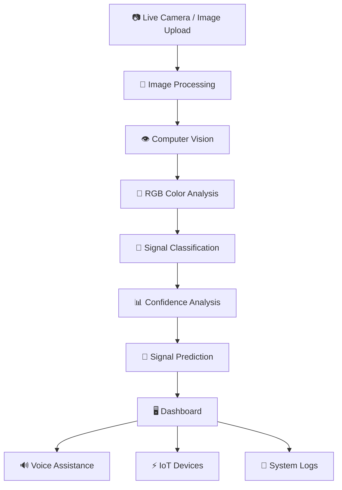

<div align="center">

# 🚦 AI Traffic Co-Pilot

### Real-Time Traffic Signal Detection, Prediction & Intelligent Assistance

<br>


<br><br>

### 👁️ See · Understand · Predict · Assist

</div>

---

# 📖 Overview

**AI Traffic Co-Pilot** is an intelligent traffic-assistance platform designed to detect traffic signal states in real time and provide useful information to drivers and connected systems.

The system uses **computer vision and image-based color analysis** to identify traffic signal states such as:

- 🔴 RED
- 🟡 YELLOW
- 🟢 GREEN

The platform provides a real-time interface where users can use a **live webcam feed or upload an image** for traffic signal analysis.

It also provides signal status, detection confidence, prediction information, system logs, and IoT-oriented controls through a centralized dashboard.

---

# 🎯 Problem Statement

Traffic signals are an essential part of road safety and traffic management.

However, drivers and intelligent transportation systems may face challenges when:

- 🚦 Traffic signals are difficult to identify
- 🌧️ Visibility conditions affect signal recognition
- 📷 Camera-based systems need real-time interpretation
- ⏱️ Drivers need information about upcoming signal changes
- 🤖 Connected systems require machine-readable signal information

A computer-vision-based assistant can help interpret traffic signal information and provide real-time feedback.

---

# 💡 Proposed Solution

AI Traffic Co-Pilot analyzes traffic signal images or live camera frames and determines the visible traffic signal state.

The system workflow is:

```text
             Camera / Image
                    │
                    ▼
           Image Acquisition
                    │
                    ▼
          Computer Vision
                    │
                    ▼
          RGB Color Analysis
                    │
                    ▼
        Traffic Signal Detection
                    │
                    ▼
          Confidence Analysis
                    │
                    ▼
       Signal Status Generation
                    │
                    ▼
        Signal Prediction Layer
                    │
                    ▼
        User / System Assistance
```

---

# ✨ Key Features

## 📷 Live Webcam Detection

Use the device camera to provide a live feed for traffic signal analysis.

## 🖼️ Image Upload

Upload an image of a traffic signal for analysis.

## 📱 Mobile Capture

The interface provides a mobile-oriented capture option for future or connected-device use.

## 🚦 Traffic Signal Detection

The system identifies traffic signal states including:

```text
🔴 RED
🟡 YELLOW
🟢 GREEN
```

## 📊 Detection Confidence

Displays the confidence associated with the detected signal.

## 🔮 Signal Prediction

Provides information about the current signal and the expected next signal state.

## ⚡ Real-Time System Status

The dashboard provides an active system indicator and continuously updates detection information.

## 🔊 Voice Assistance

The interface includes voice-related controls for future intelligent driving assistance.

## 🚨 Emergency-Oriented Assistance

The platform is designed with emergency-assistance capabilities as part of its intelligent traffic-support concept.

## 💡 IoT Device Controls

The dashboard includes controls for connected devices such as:

- LED
- Motor
- Buzzer

These can be extended for hardware-based traffic-control or alert systems.

## 📜 System Logs

The system records detected signal events and confidence information for monitoring and analysis.

---

# 🧠 Computer Vision Pipeline

```text
┌───────────────────────┐
│     Camera / Image    │
└───────────┬───────────┘
            │
            ▼
┌───────────────────────┐
│   Frame Acquisition   │
└───────────┬───────────┘
            │
            ▼
┌───────────────────────┐
│ Image Processing      │
└───────────┬───────────┘
            │
            ▼
┌───────────────────────┐
│ RGB Color Analysis    │
└───────────┬───────────┘
            │
            ▼
┌───────────────────────┐
│ Signal Classification │
└───────────┬───────────┘
            │
            ▼
┌───────────────────────┐
│ Confidence Calculation│
└───────────┬───────────┘
            │
            ▼
┌───────────────────────┐
│ Signal Status         │
└───────────────────────┘
```

---

# 🏗️ System Architecture



---

# 🖥️ Dashboard

The dashboard provides a centralized interface for traffic-signal monitoring.

### Main Dashboard Components

```text
┌───────────────────────────────────────────────┐
│           AI Traffic Signal Detector          │
├───────────────────────────────────────────────┤
│                                               │
│  📷 Live Webcam     🖼️ Upload Image           │
│                                               │
├───────────────────┬───────────────────────────┤
│                   │                           │
│   Live Camera     │     System Decision      │
│      Feed         │                           │
│                   │        STOP / WAIT        │
│                   │                           │
├───────────────────┼───────────────────────────┤
│ IoT Devices       │ Signal Detection          │
│                   │                           │
│ 💡 LED            │ 🔴 RED                    │
│ ⚡ Motor          │ 🟡 YELLOW                 │
│ 🔊 Buzzer         │ 🟢 GREEN                  │
│                   │                           │
├───────────────────┴───────────────────────────┤
│              Signal Prediction                │
├───────────────────────────────────────────────┤
│                 System Logs                   │
└───────────────────────────────────────────────┘
```

---

# 📊 Detection & Prediction

The system displays information such as:

- Current traffic signal
- Detection status
- Detection confidence
- Time to signal change
- Next predicted signal
- System decision
- Detection mode
- Historical system logs

Example:

```text
Current Signal:
WAIT

Detection Status:
Waiting

Detection Mode:
AI Vision Active

Next Signal:
STOP Coming
```

---

# 🛠️ Technology Stack

## 🤖 Artificial Intelligence

- Artificial Intelligence
- Computer Vision
- Image Processing
- Color-based Signal Detection

## 🎨 Vision Processing

- RGB Color Analysis
- Image Frame Processing
- Confidence Scoring

## 💻 Application

Depending on the current implementation:

- React
- Next.js
- TypeScript
- Tailwind CSS

## ⚡ IoT

- LED
- Motor
- Buzzer
- Future microcontroller integration

## 🧰 Development Tools

- Git
- GitHub
- VS Code

---

# 📂 Project Structure

```text
AI-Traffic-Co-Pilot/
│
├── public/
│
├── src/
│
├── components/
│
├── app/
│
├── README.md
├── package.json
├── tsconfig.json
├── tailwind.config.ts
├── .gitignore
└── LICENSE
```

> The exact structure may evolve as additional AI, IoT, and traffic-assistance features are implemented.

---

# ⚙️ Installation

## 1. Clone the Repository

```bash
git clone https://github.com/darshan-nn24/AI-Traffic-Co-Pilot.git
```

## 2. Navigate to the Project

```bash
cd AI-Traffic-Co-Pilot
```

## 3. Install Dependencies

```bash
npm install
```

## 4. Start Development Server

```bash
npm run dev
```

## 5. Open in Browser

```text
http://localhost:3000
```

---

# 🔄 How It Works

### Step 1 — Capture

The system receives a traffic-signal image from a live webcam or uploaded image.

### Step 2 — Analyze

The image is processed using computer-vision techniques.

### Step 3 — Detect

RGB color information is analyzed to identify the active traffic signal.

### Step 4 — Classify

The system determines whether the signal is:

```text
RED
YELLOW
GREEN
```

### Step 5 — Calculate Confidence

The system generates a confidence value for the detection.

### Step 6 — Predict

The prediction layer provides information about the current and upcoming signal.

### Step 7 — Assist

The dashboard communicates the result through visual information and can be extended with voice and IoT assistance.

---

# 🚀 Future Improvements

The project can be extended with:

- 🧠 Advanced deep-learning-based traffic-light detection
- 🚗 Vehicle detection and tracking
- 🚦 Automatic signal-timing estimation
- 🔮 Improved signal transition prediction
- 🎙️ Advanced voice assistant
- 🚨 Emergency vehicle detection
- 📱 Mobile application
- ⚡ ESP32 / Arduino IoT integration
- 🔊 Intelligent buzzer alerts
- 🗺️ GPS-based traffic assistance
- ☁️ Cloud-based analytics
- 📊 Traffic pattern analysis
- 🌐 Multi-camera support
- 🛣️ Smart-city integration

---

# 🌍 Potential Applications

AI Traffic Co-Pilot can be explored for:

- 🚗 Driver assistance
- 🛣️ Intelligent transportation systems
- 🏙️ Smart-city applications
- 🚦 Traffic monitoring
- 🤖 Autonomous driving research
- ⚡ IoT-based traffic systems
- 🚨 Emergency vehicle assistance
- 📷 Computer-vision research

---

# 🔬 Innovation

The project combines multiple technologies into a single traffic-assistance concept:

```text
Computer Vision
       +
Real-Time Detection
       +
Signal Prediction
       +
Voice Assistance
       +
IoT Integration
       =
AI Traffic Co-Pilot
```

The goal is to move beyond simple traffic-light detection toward an intelligent system capable of **understanding, predicting, and assisting with traffic-signal information**.

---

# 🤝 Contribution

Contributions and suggestions are welcome.

### Development Workflow

```bash
git checkout -b feature/your-feature

git add .

git commit -m "Add: your feature"

git push origin feature/your-feature
```

Then create a **Pull Request** on GitHub.

---

# 👨‍💻 Author

<div align="center">

## Darshan Nagaraj Naik

**Information Science & Engineering Student**

**AI & Machine Learning Enthusiast · Software Developer**

<br>

<a href="https://github.com/darshan-nn24">

</a>

<a href="https://www.linkedin.com/in/darshan-nagaraj-naik-7b004a299/">

</a>

<a href="mailto:darshannnaikdarshannnaik@gmail.com">

</a>

</div>

---

# 📄 License

This project is licensed under the **MIT License**.

---

<div align="center">

## 🚦 See. Understand. Predict. Assist.

### **"Building intelligent systems for safer and smarter mobility."**

<br>

⭐ If you find this project interesting, consider giving it a star!

<br><br>


</div>
